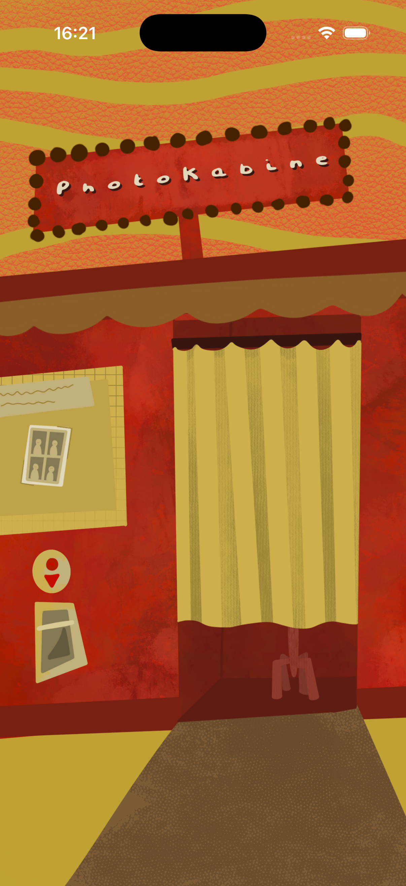
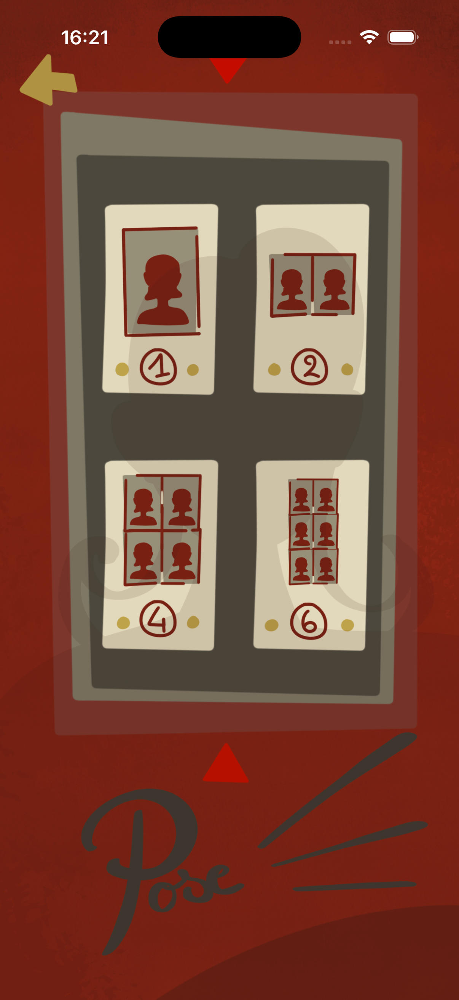
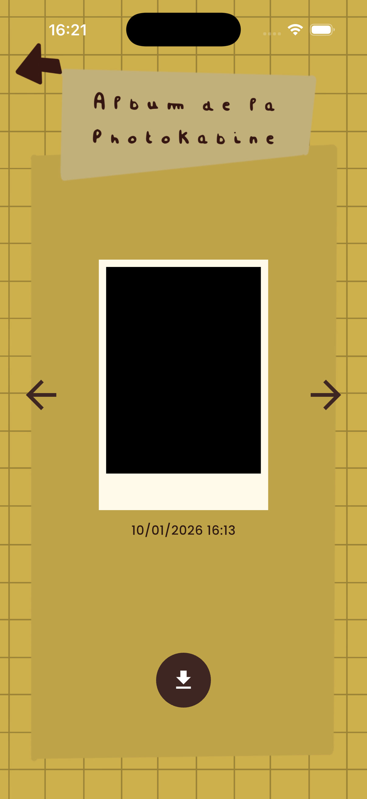

# PhotoKabine

Une application iOS immersive !!! (développée en Flutter) PhotoKabine permet de prendre des photos vintage style photobooth et de les partager :D

## Installation

1. **Cloner ou télécharger le projet**

2. **Installer les dépendances** :

```bash
flutter pub get
```

3. **Générer les adaptateurs Hive** :

```bash
flutter pub run build_runner build --delete-conflicting-outputs
```

4. **Configurer les permissions iOS** :

   Le fichier `ios/Runner/Info.plist` est déjà configuré avec la permission caméra. Si nécessaire, ajoutez :

```xml
<key>NSCameraUsageDescription</key>
<string>Cette application a besoin d'accéder à la caméra pour prendre des photos dans le photobooth.</string>
```

5. **Lancer l'application** :

```bash
flutter run
```

## 📁 Structure du projet

```
lib/
├── main.dart                      # Point d'entrée de l'application
├── models/
│   └── photo_model.dart          # Modèle de données pour les photos (Hive)
├── services/
│   ├── camera_service.dart       # Gestion de la caméra et permissions
│   └── storage_service.dart      # Stockage local avec Hive, traitement d'images
└── screens/
    ├── home_screen.dart           # Écran principal avec boutons panneau/rideau
    ├── rideau_screen.dart        # Sélection du nombre de photos (1, 2, 4, 6)
    ├── camera_preview_screen.dart # Aperçu caméra avec compte à rebours
    └── journal_screen.dart        # Galerie avec navigation et filtres sépia
```

## Technologies utilisées

- **Flutter** : Framework de développement multiplateforme
- **Hive** : Base de données locale NoSQL pour le stockage persistant
- **Camera** : Plugin pour accéder à la caméra iOS
- **Permission Handler** : Gestion des permissions système
- **Google Fonts** : Typographie personnalisée
- **Gal** : Sauvegarde des photos dans la galerie iOS
- **Intl** : Formatage des dates

## Utilisation

1. **Prendre une photo** :

   - Cliquez sur les rideaux du photobooth sur l'écran d'accueil
   - Sélectionnez le nombre de photos (1, 2, 4 ou 6)
   - Attendez le compte à rebours de 5 secondes
   - Les photos sont automatiquement sauvegardées

2. **Voir le journal** :

   - Cliquez sur le panneau sur l'écran d'accueil
   - Naviguez entre les photos avec les flèches
   - Les photos sont affichées avec un filtre sépia

3. **Sauvegarder dans la galerie** :
   - Dans le journal, cliquez sur l'icône de téléchargement en bas
   - La photo est sauvegardée dans la galerie iOS

## Fonctionnalités techniques

- **Détection de transparence** : Les boutons utilisent la détection de pixels transparents pour gérer les zones cliquables
- **Retournement automatique** : Les images de la caméra frontale sont automatiquement retournées horizontalement
- **Combinaison de photos** : Les photos multiples sont combinées en bandes verticales avec séparations blanches
- **Affichage adaptatif** : Grilles spéciales pour 2, 4 et 6 photos avec séparateurs
- **Gestion mémoire** : Libération automatique des ressources image après traitement

## Tests

Le projet inclut une suite complète de tests unitaires et widget.

### Exécuter les tests

```bash
# Tous les tests
flutter test

# Tests avec couverture
flutter test --coverage

# Tests spécifiques
flutter test test/models/photo_model_test.dart
flutter test test/services/
flutter test test/screens/
```

### Structure des tests

- **test/models/** : Tests unitaires pour les modèles de données
- **test/services/** : Tests unitaires pour les services (CameraService, StorageService)
- **test/screens/** : Tests widget pour les écrans
- **test/widget_test.dart** : Tests d'intégration pour l'application principale

## Fonctionnalités

- **Écran principal immersif** : Décor animé avec photobooth et rideaux cliquables
- **Animation des rideaux** : Ouverture/fermeture fluide avec 21 frames lors de la prise de photo
- **Prise de photos multiples** : Support pour 1, 2, 4 ou 6 photos avec combinaison automatique en bandes
- **Compte à rebours** : Délai de 5 secondes avant chaque photo
- **Journal local** : Stockage de toutes les photos avec Hive et affichage avec filtre sépia
- **Détection de transparence** : Zones cliquables intelligentes basées sur la transparence des pixels
- **Export galerie** : Sauvegarde des photos dans la galerie iOS
- **Gestion simulateur** : Génération automatique de photos noires pour les tests sur simulateur

## À améliorer

- Ajouter des bruitages
- Améliorer le rendu des photos
- Pouvoir partager ses photos via l'application
- Autres formats
- Autres filtres
- Possibilité d'ajouter des notes
- Suppression des photos
- Optimisation (pour que l'appli soit moint lente, chargement pendant animation du rideau...)

## Aperçues

### Menu principal



### Écran de prise de photo



### Journal des photos


